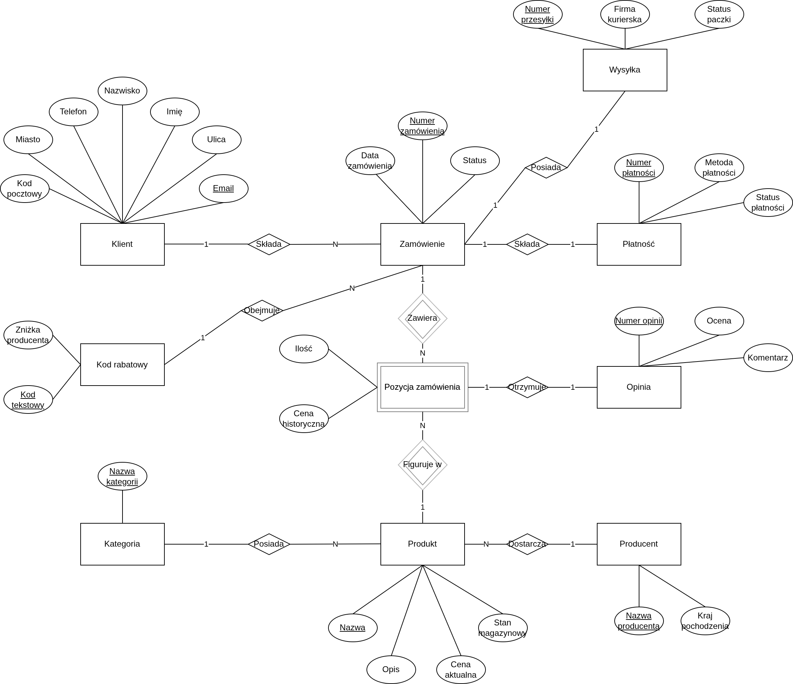
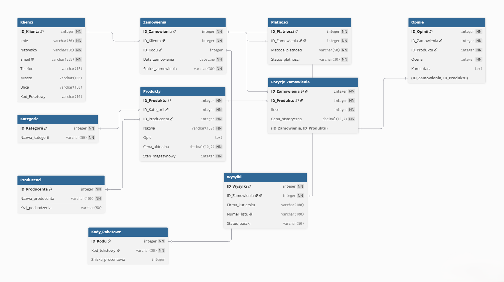
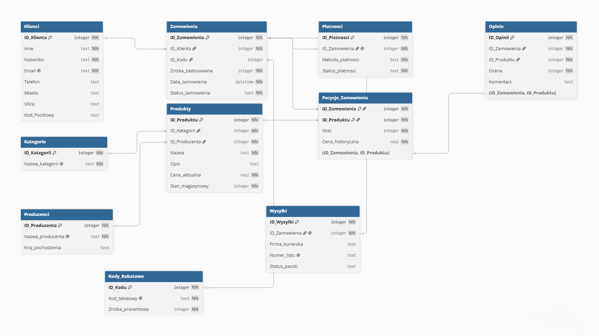
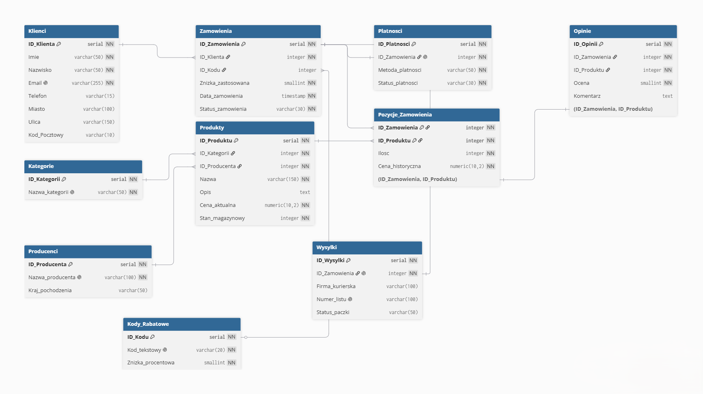

=========================================
Projektowanie bazy danych
=========================================

:Autorzy:
    1. Oskar Wrona
    2. Kamil Lewandowski
    3. Adam Tarkowski

1. Wybór zagadnienia, opis procesów i danych
============================================

**Wybrane zagadnienie:** System zarządzania sprzedażą w sklepie internetowym. Projekt obejmuje obsługę kartoteki klientów, asortymentu produktów z uwzględnieniem producentów, kategoryzacji towarów, obsługę kodów rabatowych oraz proces składania i obsługi zamówień, w tym płatności, zaawansowaną logistykę wysyłek i recenzje.

**Opis procesów i więzy integralności:**

Głównym procesem jest realizacja transakcji zakupu.

* **Rejestracja:** Klient rejestruje się w systemie, podając dane osobowe oraz adresowe (więź integralności: unikalny adres e-mail). Zarejestrowany klient może składać zamówienia.
* **Katalog produktów:** Produkty przypisane są do określonych kategorii oraz do konkretnych producentów (marek), co pozwala na precyzyjne filtrowanie oferty.
* **Koszyk, Kody Rabatowe i Zamówienie:** Każde zamówienie ma swój cykl życia określony statusem (np. "Nowe", "Wysłane", "Dostarczone"). Podczas tworzenia zamówienia klient dodaje produkty do koszyka i może opcjonalnie zastosować kod rabatowy obniżający wartość transakcji. Ponieważ ceny produktów mogą ulegać zmianom w czasie, system podczas finalizacji transakcji trwale zapisuje cenę historyczną dla każdej kupowanej pozycji.
* **Logistyka i Wysyłki:** Po zatwierdzeniu zamówienia może zostać utworzona wysyłka. System oddzielnie śledzi parametry logistyczne, takie jak firma kurierska, numer listu przewozowego oraz status doręczenia paczki.
* **Płatności:** Do zamówienia może zostać przypisana transakcja płatnicza. System oddzielnie śledzi status płatności (np. "Oczekująca", "Zakończona", "Odrzucona") w zależności od wybranej metody (BLIK, Karta, Przelew).
* **Opinie:** Po zakończeniu procesu dostawy, klient może wystawić ocenę (w skali 1-5) i komentarz do zakupionych produktów, co pomaga budować rekomendacje w sklepie.

**Wykaz gromadzonych danych:**

* **Dane klienta:** Imię, Nazwisko, Adres e-mail, Numer telefonu, Miasto, Ulica, Kod pocztowy.
* **Dane produktu:** Nazwa produktu, Opis techniczny, Cena jednostkowa, Stan magazynowy.
* **Dane producenta:** Nazwa producenta, Kraj pochodzenia.
* **Dane kategorii:** Nazwa kategorii.
* **Dane rabatowe:** Kod tekstowy rabatu, Zniżka procentowa.
* **Dane zamówienia:** Data złożenia, Status zamówienia.
* **Dane wysyłki:** Firma kurierska, Numer listu przewozowego, Status paczki.
* **Dane płatności:** Metoda płatności, Status płatności.
* **Dane szczegółowe transakcji:** Ilość zamawianych sztuk konkretnego produktu, Cena zakupu (historyczna).
* **Dane opinii:** Ocena (1-5), Komentarz.

2. Prototyp CSV
===============

Aby zweryfikować kompletność przetwarzanych informacji, przygotowano "płaską" (nieznormalizowaną) reprezentację danych dla transakcji zakupu uwzględniającą nowe procesy. Zastosowano separator średnikowy, zgodny ze skryptami importującymi dane do PostgreSQL i SQLite. Wartość ``ID_Zamowienia`` jest powtarzana dla wszystkich produktów należących do tej samej transakcji.

.. code-block::

    ID_Zamowienia;Imie;Nazwisko;Email;Telefon;Miasto;Ulica;Kod_Pocztowy;Producent;Kraj_Producenta;Nazwa_Produktu;Kategoria;Kod_Rabatowy;Znizka;Cena_Aktualna;Stan_Magazynowy;Data_Zamowienia;Status_Zamowienia;Firma_Kurierska;Numer_Listu;Status_Paczki;Metoda_Platnosci;Status_Platnosci;Ilosc_Zakupiona;Cena_Historyczna;Ocena_Produktu;Komentarz
    1;Piotr;Nowak;p.nowak@pwr.edu.pl;600700800;Wrocław;Wybrzeże Wyspiańskiego 27;50-370;Samsung;Korea Pd.;Monitor 4K;Elektronika;STUDENT20;20;1200.00;10;2023-11-20;Dostarczone;InPost;654321987;Doręczona;BLIK;Zakończona;1;1200.00;5;"Świetny monitor, polecam!"
    1;Piotr;Nowak;p.nowak@pwr.edu.pl;600700800;Wrocław;Wybrzeże Wyspiańskiego 27;50-370;Logitech;Szwajcaria;Kabel HDMI;Elektronika;STUDENT20;20;50.00;50;2023-11-20;Dostarczone;InPost;654321987;Doręczona;BLIK;Zakończona;2;45.00;4;"Dobry kabel, ale sztywny."

3. Model Konceptualny (Pojęciowy)
=================================

Na podstawie analizy procesów i zebranych danych opracowano model pojęciowy, identyfikując obiekty, ich cechy oraz powiązania.

Zidentyfikowane encje
---------------------

* **Klient** - osoba fizyczna dokonująca zakupów.
* **Producent** - marka wytwarzająca dany towar.
* **Produkt** - towar znajdujący się w ofercie sklepu.
* **Kategoria** - klasyfikacja grupująca asortyment.
* **Kod Rabatowy** - bonifikata cenowa możliwa do użycia w koszyku.
* **Zamówienie** - zdarzenie potwierdzające zawarcie transakcji.
* **Wysyłka** - proces logistyczny doręczenia paczki.
* **Płatność** - proces autoryzacji i przekazania środków za zamówienie.
* **Opinia** - recenzja konkretnego produktu z danego zamówienia.
* **Pozycja zamówienia** - encja asocjacyjna opisująca konkretny produkt występujący w zamówieniu.

Zdefiniowane atrybuty/własności
-------------------------------

* **Dla encji Klient:** ``Imię``, ``Nazwisko``, ``E-mail`` (identyfikator unikalny), ``Telefon``, ``Miasto``, ``Ulica``, ``Kod pocztowy``.
* **Dla encji Producent:** ``Nazwa producenta``, ``Kraj pochodzenia``.
* **Dla encji Produkt:** ``Nazwa``, ``Opis``, ``Cena aktualna``, ``Stan magazynowy``.
* **Dla encji Kategoria:** ``Nazwa kategorii``.
* **Dla encji Kod Rabatowy:** ``Kod tekstowy``, ``Zniżka procentowa``.
* **Dla encji Zamówienie:** ``Data zamówienia``, ``Status zamówienia``.
* **Dla encji Wysyłka:** ``Firma kurierska``, ``Numer listu przewozowego``, ``Status paczki``.
* **Dla encji Płatność:** ``Metoda płatności``, ``Status płatności``.
* **Dla encji Opinia:** ``Ocena``, ``Komentarz``.
* **Dla encji Pozycja zamówienia:** ``Ilość``, ``Cena historyczna``.

Opis związków
-------------

* **Klient – Zamówienie (1:N):** Klient może złożyć zero lub wiele zamówień. Każde zamówienie jest przypisane do dokładnie jednego klienta.
* **Producent – Produkt (1:N):** Producent może wytwarzać zero lub wiele produktów. Każdy produkt ma dokładnie jednego producenta.
* **Kategoria – Produkt (1:N):** Kategoria może grupować zero lub wiele produktów. Każdy produkt należy do dokładnie jednej kategorii.
* **Kod Rabatowy – Zamówienie (1:N):** Jeden kod promocyjny może zostać użyty w wielu zamówieniach, natomiast zastosowanie kodu w zamówieniu jest opcjonalne.
* **Zamówienie – Wysyłka (1:0..1):** Zamówienie może nie mieć jeszcze wysyłki albo może mieć najwyżej jedną wysyłkę. Każda wysyłka dotyczy dokładnie jednego zamówienia.
* **Zamówienie – Produkt (M:N):** Jedno zamówienie obejmuje wiele produktów. Dany produkt występuje w wielu zamówieniach. (Związek rozwiązywany przez encję słabą *Pozycja zamówienia*).
* **Zamówienie – Płatność (1:0..1):** Zamówienie może nie mieć jeszcze płatności albo może mieć najwyżej jedną transakcję płatniczą. Każda płatność dotyczy dokładnie jednego zamówienia.
* **Pozycja zamówienia – Opinia (1:0..1):** Konkretny zakupiony produkt w danym zamówieniu może, ale nie musi, zostać zrecenzowany przez klienta.

Określenie związków niepoprawnych (pułapki połączeń)
----------------------------------------------------

Zidentyfikowano ryzyko utworzenia redundantnego połączenia encji *Klient* z encją *Produkt* (np. relacją „Klient kupuje Produkt”). Taki związek dublowałby ścieżkę *Klient – Zamówienie – Pozycja zamówienia – Produkt* i mógłby prowadzić do niespójności danych lub błędnych połączeń w zapytaniach. Właściwa ścieżka zachowuje kontekst transakcyjny: datę i status zamówienia, cenę historyczną, liczbę sztuk oraz informację o produktach kupionych razem. Z tego samego powodu opinii nie połączono bezpośrednio z klientem, lecz z konkretną pozycją zamówienia.

Identyfikacja encji słabych
---------------------------

Ze względu na występowanie naturalnej relacji wiele-do-wielu (M:N) między *Zamówieniem* a *Produktem*, zidentyfikowano encję słabą, która uszczegóławia tę relację.

* **Uzasadnienie:** Jest to byt, który nie ma racji bytu bez istnienia zarówno konkretnego zamówienia, jak i produktu. Posłuży on do przechowywania informacji o parametrach transakcji dla danego towaru.
* **Atrybuty encji słabej:** ``Ilość`` (liczba sztuk danego produktu w danym zamówieniu) oraz ``Cena historyczna`` (gwarantująca niezmienność kwoty na archiwalnym zamówieniu).
* **Encja słaba:** ``Pozycja zamówienia``

Schemat w notacji Chena
-----------------------

   Rysunek 1: Model konceptualny bazy danych sklepu internetowego.

4. Model logiczny i proces normalizacji
=======================================

Celem tego etapu jest przekształcenie "płaskich" danych do 3. Postaci Normalnej (3NF) w celu eliminacji anomalii i redundancji.

4.1. Przebieg procesu normalizacji
----------------------------------

**Krok 1: Pierwsza Postać Normalna (1NF)**

* **Wymagania:** Wiersze unikalne, komórki atomowe, istnieje klucz główny.
* **Zmiany:** Nadajemy sztuczne identyfikatory transakcji (``ID_Zamowienia``) oraz produktu (``ID_Produktu``). Złożenie tych dwóch stanowi klucz główny. Dane (w tym recenzje, producenci i płatności) powielają się w wielu wierszach.

**Krok 2: Druga Postać Normalna (2NF)**

* **Wymagania:** Brak częściowych zależności funkcyjnych od klucza złożonego.
* **Zmiany:** Rozbijamy płaską tabelę:

    1. *Zależne od ID_Produktu:* Nazwa, Cena aktualna, Stan, Producent (dane), Kategoria -> **Produkty**
    2. *Zależne od ID_Zamowienia:* Data, Status, Klient (dane), Kod rabatowy (dane), Wysyłka (dane logistyczne), Płatność (dane transakcyjne) -> **Zamówienia**
    3. *Zależne od całego klucza (ID_Zam + ID_Prod):* Ilość, Cena_historyczna, Ocena, Komentarz -> **Pozycje_Zamowienia**

**Krok 3: Trzecia Postać Normalna (3NF)**

* **Wymagania:** Brak zależności przechodnich (żaden atrybut niekluczowy nie zależy od innego atrybutu niekluczowego).
* **Zmiany:**

    1. Z tabeli *Zamówienia* wydzielamy powtarzające się dane klientów do tabeli **Klienci** (``ID_Klienta``).
    2. Z tabeli *Produkty* wydzielamy nazwę kategorii do tabeli **Kategorie** (``ID_Kategorii``) oraz dane o marce do tabeli **Producenci** (``ID_Producenta``).
    3. Z tabeli *Zamówienia* wydzielamy dane promocyjne do tabeli **Kody_Rabatowe** (``ID_Kodu``).
    4. Z tabeli *Zamówienia* wydzielamy dane kodu rabatowego do tabeli **Kody_Rabatowe** (``ID_Kodu``).

Po osiągnięciu 3NF zastosowano dodatkową dekompozycję funkcjonalną. Dane posiadające odrębny cykl życia lub występujące opcjonalnie przeniesiono do tabel **Platnosci**, **Wysylki** i **Opinie**. Dzięki temu brak płatności, wysyłki albo opinii nie wymaga przechowywania pustych zestawów atrybutów w tabelach podstawowych.

4.2. Ostateczna struktura tabel (3NF)
-------------------------------------

Wyodrębniono 10 w pełni znormalizowanych tabel.

* **Klienci**

    * ``ID_Klienta`` (PK)
    * ``Imie``, ``Nazwisko``, ``Email``, ``Telefon``, ``Miasto``, ``Ulica``, ``Kod_Pocztowy``

* **Producenci**

    * ``ID_Producenta`` (PK)
    * ``Nazwa_producenta``, ``Kraj_pochodzenia``

* **Kategorie**

    * ``ID_Kategorii`` (PK)
    * ``Nazwa_kategorii``

* **Produkty**

    * ``ID_Produktu`` (PK)
    * ``ID_Kategorii`` (FK -> Kategorie)
    * ``ID_Producenta`` (FK -> Producenci)
    * ``Nazwa``, ``Opis``, ``Cena_aktualna``, ``Stan_magazynowy``

* **Kody_Rabatowe**

    * ``ID_Kodu`` (PK)
    * ``Kod_tekstowy``, ``Znizka_procentowa``

* **Zamowienia**

    * ``ID_Zamowienia`` (PK)
    * ``ID_Klienta`` (FK -> Klienci)
    * ``ID_Kodu`` (FK -> Kody_Rabatowe)
    * ``Data_zamowienia``, ``Status_zamowienia``

* **Wysylki**

    * ``ID_Wysylki`` (PK)
    * ``ID_Zamowienia`` (FK -> Zamowienia)
    * ``Firma_kurierska``, ``Numer_listu``, ``Status_paczki``

* **Platnosci**

    * ``ID_Platnosci`` (PK)
    * ``ID_Zamowienia`` (FK -> Zamowienia)
    * ``Metoda_platnosci``, ``Status_platnosci``

* **Pozycje_Zamowienia**

    * ``ID_Zamowienia`` (PK, FK -> Zamowienia)
    * ``ID_Produktu`` (PK, FK -> Produkty)
    * ``Ilosc``, ``Cena_historyczna``

* **Opinie**

    * ``ID_Opinii`` (PK)
    * ``ID_Zamowienia`` (FK -> Pozycje_Zamowienia)
    * ``ID_Produktu`` (FK -> Pozycje_Zamowienia)
    * ``Ocena``, ``Komentarz``

4.3. Najważniejsze więzy integralności modelu logicznego
---------------------------------------------------------

* Klucz główny tabeli **Pozycje_Zamowienia** jest złożony z pól ``ID_Zamowienia`` i ``ID_Produktu``.
* Para ``ID_Zamowienia`` i ``ID_Produktu`` w tabeli **Opinie** jest jednocześnie kluczem obcym do pozycji zamówienia oraz posiada ograniczenie ``UNIQUE``. Dzięki temu jedną pozycję można ocenić najwyżej raz.
* Pola ``ID_Zamowienia`` w tabelach **Platnosci** i **Wysylki** są wymagane i unikalne, co realizuje związki 1:0..1.
* Pola ``Email``, ``Kod_tekstowy`` oraz ``Numer_listu`` posiadają ograniczenia unikalności.
* ``ID_Kodu`` w tabeli **Zamowienia** jest opcjonalne. Pozostałe klucze obce identyfikujące klienta, producenta, kategorię i pozycję zamówienia są wymagane.
* Wartości ceny i stanu magazynowego nie mogą być ujemne, liczba sztuk musi być większa od zera, zniżka mieści się w zakresie 0–100, a ocena w zakresie 1–5.

4.4. Diagram ERD (Model Logiczny)
---------------------------------

   Rysunek 2: Model logiczny (ERD) bazy danych w 3. Postaci Normalnej.

5. Model fizyczny bazy danych
================================

Różnice między modelami wynikają z dostępnych klas przechowywania (SQLite) i zaawansowanych typów precyzyjnych (PostgreSQL).

5.1. Model fizyczny dla środowiska SQLite
-----------------------------------------

Silnik SQLite używa dynamicznego systemu typów opartego na klasach przechowywania, między innymi INTEGER, REAL, TEXT i BLOB. W projekcie datę zamówienia zadeklarowano jako ``DATETIME``, natomiast wartości pieniężne są przechowywane jako ``REAL``.

**Specyfikacja tabel (SQLite):**

* **Klienci**: ``ID_Klienta`` : INTEGER (PK, AUTOINCREMENT), ``Imie`` : TEXT, ``Nazwisko`` : TEXT, ``Email`` : TEXT, ``Telefon`` : TEXT, ``Miasto`` : TEXT, ``Ulica`` : TEXT, ``Kod_Pocztowy`` : TEXT
* **Producenci**: ``ID_Producenta`` : INTEGER (PK, AUTOINCREMENT), ``Nazwa_producenta`` : TEXT, ``Kraj_pochodzenia`` : TEXT
* **Kategorie**: ``ID_Kategorii`` : INTEGER (PK, AUTOINCREMENT), ``Nazwa_kategorii`` : TEXT
* **Kody_Rabatowe**: ``ID_Kodu`` : INTEGER (PK, AUTOINCREMENT), ``Kod_tekstowy`` : TEXT, ``Znizka_procentowa`` : INTEGER
* **Produkty**: ``ID_Produktu`` : INTEGER (PK, AUTOINCREMENT), ``ID_Kategorii`` : INTEGER (FK), ``ID_Producenta`` : INTEGER (FK), ``Nazwa`` : TEXT, ``Opis`` : TEXT, ``Cena_aktualna`` : REAL, ``Stan_magazynowy`` : INTEGER
* **Zamowienia**: ``ID_Zamowienia`` : INTEGER (PK, AUTOINCREMENT), ``ID_Klienta`` : INTEGER (FK), ``ID_Kodu`` : INTEGER (FK), ``Data_zamowienia`` : DATETIME, ``Status_zamowienia`` : TEXT
* **Wysylki**: ``ID_Wysylki`` : INTEGER (PK, AUTOINCREMENT), ``ID_Zamowienia`` : INTEGER (FK), ``Firma_kurierska`` : TEXT, ``Numer_listu`` : TEXT, ``Status_paczki`` : TEXT
* **Platnosci**: ``ID_Platnosci`` : INTEGER (PK, AUTOINCREMENT), ``ID_Zamowienia`` : INTEGER (FK), ``Metoda_platnosci`` : TEXT, ``Status_platnosci`` : TEXT
* **Pozycje_Zamowienia**: ``ID_Zamowienia`` : INTEGER (PK, FK), ``ID_Produktu`` : INTEGER (PK, FK), ``Ilosc`` : INTEGER, ``Cena_historyczna`` : REAL
* **Opinie**: ``ID_Opinii`` : INTEGER (PK, AUTOINCREMENT), ``ID_Zamowienia`` : INTEGER (FK), ``ID_Produktu`` : INTEGER (FK), ``Ocena`` : INTEGER, ``Komentarz`` : TEXT

   Rysunek 3: Fizyczny schemat bazy danych opracowany dla silnika SQLite.

5.2. Model fizyczny dla środowiska PostgreSQL
---------------------------------------------

Zastosowano typy tekstowe ograniczające długość (VARCHAR), dedykowany typ znacznika czasu (TIMESTAMP) oraz dokładny typ liczbowy NUMERIC dla wartości pieniężnych. Klucze sztuczne korzystają z typu SERIAL, który automatyzuje nadawanie kolejnych identyfikatorów.

**Specyfikacja tabel (PostgreSQL):**

* **Klienci**: ``ID_Klienta`` : SERIAL (PK), ``Imie`` : VARCHAR(50), ``Nazwisko`` : VARCHAR(50), ``Email`` : VARCHAR(255), ``Telefon`` : VARCHAR(15), ``Miasto`` : VARCHAR(100), ``Ulica`` : VARCHAR(150), ``Kod_Pocztowy`` : VARCHAR(10)
* **Producenci**: ``ID_Producenta`` : SERIAL (PK), ``Nazwa_producenta`` : VARCHAR(100), ``Kraj_pochodzenia`` : VARCHAR(50)
* **Kategorie**: ``ID_Kategorii`` : SERIAL (PK), ``Nazwa_kategorii`` : VARCHAR(50)
* **Kody_Rabatowe**: ``ID_Kodu`` : SERIAL (PK), ``Kod_tekstowy`` : VARCHAR(20), ``Znizka_procentowa`` : SMALLINT
* **Produkty**: ``ID_Produktu`` : SERIAL (PK), ``ID_Kategorii`` : INTEGER (FK), ``ID_Producenta`` : INTEGER (FK), ``Nazwa`` : VARCHAR(150), ``Opis`` : TEXT, ``Cena_aktualna`` : NUMERIC(10,2), ``Stan_magazynowy`` : INTEGER
* **Zamowienia**: ``ID_Zamowienia`` : SERIAL (PK), ``ID_Klienta`` : INTEGER (FK), ``ID_Kodu`` : INTEGER (FK), ``Data_zamowienia`` : TIMESTAMP, ``Status_zamowienia`` : VARCHAR(30)
* **Wysylki**: ``ID_Wysylki`` : SERIAL (PK), ``ID_Zamowienia`` : INTEGER (FK), ``Firma_kurierska`` : VARCHAR(100), ``Numer_listu`` : VARCHAR(100), ``Status_paczki`` : VARCHAR(50)
* **Platnosci**: ``ID_Platnosci`` : SERIAL (PK), ``ID_Zamowienia`` : INTEGER (FK), ``Metoda_platnosci`` : VARCHAR(50), ``Status_platnosci`` : VARCHAR(30)
* **Pozycje_Zamowienia**: ``ID_Zamowienia`` : INTEGER (PK, FK), ``ID_Produktu`` : INTEGER (PK, FK), ``Ilosc`` : INTEGER, ``Cena_historyczna`` : NUMERIC(10,2)
* **Opinie**: ``ID_Opinii`` : SERIAL (PK), ``ID_Zamowienia`` : INTEGER (FK), ``ID_Produktu`` : INTEGER (FK), ``Ocena`` : SMALLINT, ``Komentarz`` : TEXT

   Rysunek 4: Fizyczny schemat bazy danych opracowany dla silnika PostgreSQL.

5.3. Ograniczenia i indeksy modelu fizycznego
---------------------------------------------

W obu wariantach zastosowano te same reguły integralności: klucze główne i obce, ograniczenia ``NOT NULL``, ``UNIQUE`` i ``CHECK`` oraz odpowiednie działania referencyjne. Usunięcie zamówienia powoduje usunięcie jego pozycji, płatności, wysyłki i opinii (``ON DELETE CASCADE``). Usunięcie używanego kodu rabatowego ustawia ``ID_Kodu`` na ``NULL``, natomiast usunięcie kategorii lub producenta używanego przez produkt jest blokowane (``ON DELETE RESTRICT``).

Dodatkowe indeksy utworzono dla kluczy obcych najczęściej wykorzystywanych podczas łączenia tabel: kategorii i producenta produktu, klienta zamówienia oraz produktu w pozycji zamówienia. Ograniczenia ``UNIQUE`` dla płatności i wysyłki tworzą również indeksy zapewniające szybkie wyszukiwanie według identyfikatora zamówienia.
